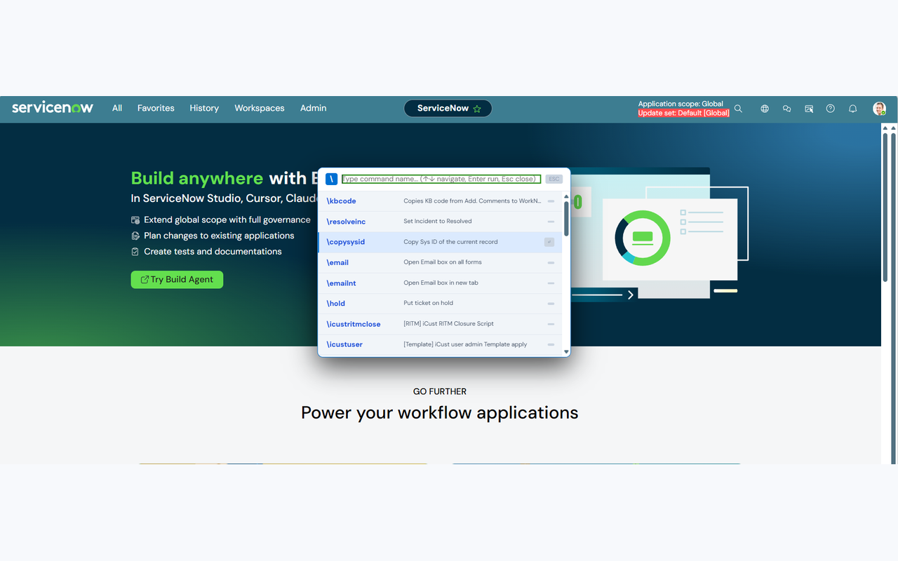

# SN Commands

A backslash (`\`) command palette for ServiceNow — save your own editable scripts
as named commands, and run any of them instantly from anywhere on the page.

Works on ServiceNow cloud instances (`*.service-now.com`) out of the box, and
can be configured to run on on-prem or custom-domain instances too.

**Install:** [Chrome Web Store](https://chromewebstore.google.com/detail/sn-commands/mcldanobcnlgmopjjkjgldngdmalahfg)
· [Firefox Add-ons](https://addons.mozilla.org/en-US/firefox/addon/sn-commands/)



---

## Features

- **`\` command palette** — press the trigger anywhere on a ServiceNow page to
  open a searchable list of your saved commands, then hit Enter (or click) to
  run one instantly.
- **Editable scripts** — every command is just a small piece of JavaScript you
  write and can edit any time, with a full-screen CodeMirror editor, syntax
  highlighting, and auto-formatting.
- **Import / Export** — back up your command library as JSON, or share it with
  teammates. Importing merges by name (a duplicate name *replaces* the
  existing command) or can fully replace your library. A merge keeps your local
  usage history rather than resetting it.
- **Works globally, including on-prem** — turn on "all websites" access with
  one toggle, or grant access to a specific list of on-prem/custom domains from
  Settings → Instances, without needing a new extension build.
- **Usage tracking** — every command records how many times you've run it, when
  it was created, when you last edited it and when it last ran. Shown under the
  editor as `used 12 times · created 25/08/2026 · edited 25/08/2026`, and you can
  sort the library by **🔥 Most used** to see what you actually reach for.
- **Eight sample commands** on a fresh install, so there's something to try
  straight away — see [Commands included out of the box](#commands-included-out-of-the-box).
- **Optional ServiceNow page theme** — five faded palettes that restyle the
  ServiceNow header, tighten up list density and make read-only fields obviously
  inert. Map individual instances to their own palette so you can tell
  environments apart at a glance. See [Page theme](#page-theme).
- **Page helpers** — session keep-alive, a reopen-count banner on incidents, and
  Ctrl+Enter to post a work note. Three independent toggles, all off by default.
  See [Page helpers](#page-helpers).
- **Light / dark theme**, resizable panels, and a single **Sort** dropdown for
  custom order / name / date created / most used.
- **Manifest V3** on both browsers — no remote code, and nothing is ever sent to
  us or any third party.

## Installation

### From the stores (recommended)

- **Chrome / Edge / Brave:** [SN Commands on the Chrome Web Store](https://chromewebstore.google.com/detail/sn-commands/mcldanobcnlgmopjjkjgldngdmalahfg)
- **Firefox:** [SN Commands on addons.mozilla.org](https://addons.mozilla.org/en-US/firefox/addon/sn-commands/)

### Chrome / Edge / Brave (developer mode)

1. Download or clone this repository.
2. Open `chrome://extensions` (or `edge://extensions`, etc.).
3. Turn on **Developer mode** (top-right).
4. Click **Load unpacked** and select the `chrome/` folder.

### Firefox (temporary install)

1. Download or clone this repository.
2. Open `about:debugging#/runtime/this-firefox`.
3. Click **Load Temporary Add-on…** and select any file inside the `firefox/`
   folder (e.g. `firefox/manifest.json`).
4. Note: temporary add-ons are removed when Firefox restarts. For a permanent
   install, package it with `web-ext build` from inside `firefox/` and either
   self-distribute the signed `.xpi` or submit it to
   [addons.mozilla.org](https://addons.mozilla.org).

## Usage

1. Open the extension popup (toolbar icon) or the full settings page (⚙️) to
   create a command: give it a name, an optional hint, and the script to run.
2. On any supported ServiceNow page, type `\` to open the command palette.
3. Type to filter, use ↑/↓ to navigate, and press **Enter** (or click a row)
   to run a command.

<kbd>\\</kbd>, <kbd>Ctrl</kbd>+<kbd>Shift</kbd>+<kbd>Space</kbd> and <kbd>F2</kbd>
all open the palette.

### Commands included out of the box

A fresh install seeds these eight, purely so there's something to run on day
one. They're ordinary commands — edit, rename or delete any of them. Every one
reads the instance host from the page it's running on, so they work on any
instance, cloud or on-prem, with nothing to configure.

| Command | What it does |
| --- | --- |
| `\copysysid` | Copies the current record's `sys_id` to the clipboard |
| `\sysinfo` | Shows the record's number, table, `sys_id` and instance hostname |
| `\email` | Opens the email client for the current record |
| `\myprofile` | Opens your own user profile record |
| `\sowview` | Switches the record to the Service Operations Workspace view |
| `\defaultview` | Switches the record back to the Default view |
| `\excel` | Exports the current list to Excel — all columns, or just your visible ones |
| `\reload` | Reloads the current record, bypassing the browser cache |

Seeding only happens on a **fresh install**. Updating the extension never adds
entries to a library you've already built up, and if you clear your commands
they stay cleared.

## Page theme

Optional, and **off until you turn it on** — installing a command palette doesn't
restyle your instance. Settings page → **🎨 Page Theme**.

What it changes: the header gets a coloured, subtly patterned background; the
workspace goes white; lists get tighter with a coloured column underline and a
faint row hover; read-only and disabled fields get an unmistakably inert grey; and
the date picker is explicitly protected from the list rules that would otherwise
wreck its layout.

Five palettes, identical except for colour. White header text clears 4.5:1 on all
of them.

| Theme | Header | Character |
| --- | --- | --- |
| Steel Teal | `#3d7d91` | Cool and clinical, closest to stock ServiceNow |
| Info Azure | `#395f94` | Deepened from ServiceNow's own info-banner blue |
| Slate Indigo | `#4a566b` | Blue-grey, the darkest of the five |
| Sage Moss | `#5d7a59` | Faded green, easiest over a long shift |
| Ash Clay | `#8f6a5f` | Dusty terracotta, the only warm one |

### Per-instance mapping

Pick a **default theme** for every instance, then override individual ones. Giving
production a warm palette and dev a cool one makes it much harder to run something
on the wrong instance by accident.

Matching is by hostname, and more specific always wins. Map `service-now.com` to
cover every instance on it, then map `acme.service-now.com` to override just that
one. Paste a full URL if it's easier — the protocol, port and path are stripped.

### Switching from the keyboard

On any themed ServiceNow page, <kbd>Alt</kbd>+<kbd>Shift</kbd>+<kbd>T</kbd> cycles
through the palettes. The result is **saved as that instance's mapping**, so it
persists and shows up in the settings list — the shortcut and the mapping table are
two views of the same setting, not competing ones.

Changes apply to open ServiceNow tabs immediately. No reload, no save button.

### Fonts

The design this came from pulled DM Sans from Google Fonts. That would mean an
outbound request from every ServiceNow page you open, so it isn't included — the
extension makes no network requests of any kind and the page theme is styled purely
with colours built into it. `Product Sans` and `Google Sans` are used when they're
installed locally; otherwise it falls through to your platform's UI font.

## Page helpers

Three small always-on conveniences, each with its own toggle and **all off by
default**. Settings page → **⚡ Helpers**. Turning one off takes effect on open
tabs immediately, no reload.

| Helper | What it does |
| --- | --- |
| **Keep my session alive** | Pings a lightweight endpoint on your instance every *N* minutes (1–60, default 2) so you don't get logged out mid-ticket. Also pings once when you return to a tab that's been in the background, which is exactly where sessions quietly expire. |
| **Show reopen count on incidents** | When an incident form loads, reads that incident's `reopen_count` and shows it as a native banner — green at zero, red above it. Won't repeat itself for the same record. |
| **Ctrl+Enter posts a work note** | Saves reaching for the Post button. `Cmd+Enter` on macOS. Goes through Angular's own handler so the activity stream stays in step. |

### What they do on the network

Worth being precise, since two of them make requests:

- **Keep-alive** requests a small endpoint on *the instance in that tab* — nothing
  else. It sends only the session cookie your browser already sends, reads nothing
  from the page, and keeps nothing from the response.
- **Reopen count** reads two fields of one incident from your instance's own Table
  API using your existing session.
- **Ctrl+Enter** makes no requests at all; it clicks a button already on the page.

Nothing goes to us or to any third party in any case — the extension has no server.
With all three off, it makes no network requests whatsoever. Full detail in
[privacy.html](privacy.html).

### Why two of them are injected

Content scripts run in an isolated world with no access to the page's JavaScript
globals. The reopen-count banner needs `g_form` and `g_ck`; Ctrl+Enter needs
`angular`. Neither is reachable from a content script, so both are executed in the
page's MAIN world through the same background path a saved command uses. Keep-alive
only needs `fetch`, so it stays in the content script — where its timer survives as
long as the tab does, which a background service worker's would not.

They also run in **every frame**, because in classic UI the form, `g_form` and the
Post button all live inside the `gsft_main` iframe. Each injected script guards
against double-injection, so a frame that isn't a form simply does nothing.

### Running on an on-prem or custom-domain instance

By default, SN Commands only runs on `*.service-now.com`. To use it on an
on-prem instance or a differently-named cloud instance:

1. Open the full settings page → **🌐 Instances**.
2. Either:
   - Turn on **Enable on all websites** (simplest — works everywhere), or
   - Add your instance's domain under **Add specific instance domains**
     (least-privilege — Chrome will ask you to confirm access to just that
     domain).
3. Reload any already-open ServiceNow tabs.

## Project structure

```
sncommands/
├── chrome/                # Chrome/Edge/Brave build (Manifest V3, service worker)
│   ├── manifest.json
│   ├── background.js      # Service worker: script execution, seeds, usage counting
│   ├── themes.js          # Page-theme palettes + CSS builders, shared by content and settings
│   ├── helpers.js         # Page-helper definitions + injected scripts, likewise shared
│   ├── content.js         # Injected into ServiceNow pages: \ palette, page theme, helpers
│   ├── popup.html/.js     # Toolbar popup: quick command list + editor
│   ├── settings.html/.js  # Full settings page: command library, import/export, Instances, Support
│   ├── icons/             # Extension icons + UPI QR asset
│   └── lib/               # Bundled CodeMirror + js-beautify for the script editor
├── firefox/               # Firefox build (Manifest V3, event-page background)
│   └── ...                # Same files as chrome/, only manifest.json differs
├── tools/
│   ├── check-wiring.js    # Manifests, assets, DOM + message wiring, seeds, build drift
│   └── sync-firefox.ps1   # Copies shared files from chrome/ to firefox/
└── docs/
    ├── CROSS_BROWSER.md   # What differs between the two manifests, and why
    └── CHROME_STORE_NOTES.md
```

Both builds share identical `background.js` / `content.js` / `themes.js` /
`helpers.js` / `popup.*` / `settings.*` / `icons/` / `lib/` — only `manifest.json` differs per browser
(see [docs/CROSS_BROWSER.md](docs/CROSS_BROWSER.md)). `chrome/` is the source
of truth. After changing anything there, sync and re-check:

```
powershell -ExecutionPolicy Bypass -File .\tools\sync-firefox.ps1
node tools\check-wiring.js
```

`check-wiring.js` needs no `npm install` — it runs on a bare Node install. It
validates both manifests, confirms every file they and the HTML pages reference
exists, checks each `getElementById` has matching markup, verifies every message
that gets sent has a listener somewhere, parses all the JS *and* every seeded
command script, and hashes the shared files in both folders so a forgotten sync
can't reach a release.

Because `themes.js` and `helpers.js` are dependencies of both `content.js` and
`settings.js`, it also checks that side of the contract: every shared identifier the
consumers reference is actually exported, both files load *before* their consumers
in the manifest, in `settings.html` and in the dynamic content-script registration,
white header text clears 4.5:1 on all five palettes, host resolution honours
specificity, the injected helper scripts parse and guard against re-injection, every
helper and the page theme default to **off**, keep-alive endpoints are
instance-relative rather than absolute, and none of the generated CSS or injected
script contains a remote URL.

## Contributing

Issues and pull requests are welcome. If you run into a bug, please include:
the ServiceNow version/theme you're on (UI16 / Now Experience), the browser
and version, and steps to reproduce.

## Support this project

SN Commands is built and maintained in spare time. If it saves you time:

- ☕ **International:** [ko-fi.com/ysaryan](https://ko-fi.com/ysaryan)
- 🇮🇳 **India (UPI):** `ysaryanraj@okaxis` — QR code is in the Support panel
  inside the extension's settings page.
- ⭐ Starring this repo also helps — it costs nothing and helps others discover
  the project.

## Contact

Questions, bug reports and feature requests are welcome at
**[contact@davagni.eu.org](mailto:contact@davagni.eu.org)** — there's also a
✉️ **Contact Us** button in the extension's settings page and popup.

## License

GNU General Public License v3.0 — see [LICENSE](LICENSE).
